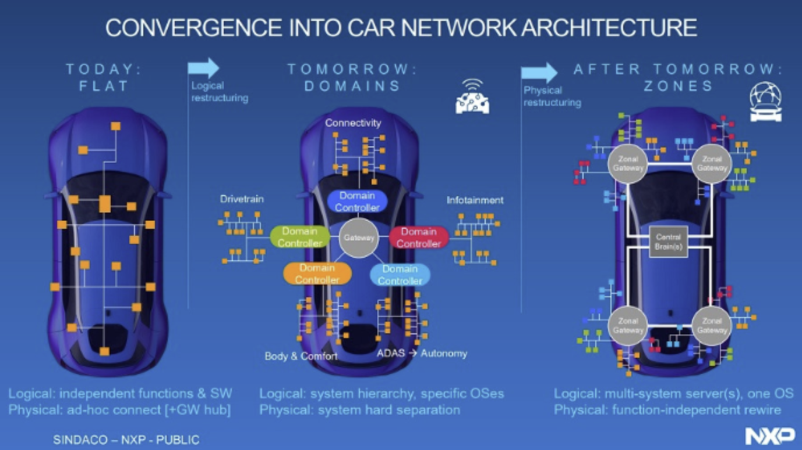

# 1. 개요

최근 자동차 산업에서 Zonal Architecture (존 아키텍처)가 중요한 트렌드로 부각되고 있다.
기존의 차량 전자·전기(E/E) 아키텍처는 복잡한 배선과 다수의 전자제어장치(ECU)로 인해 성능과 확장성에 한계를 보였다.
하지만 SDV의 발전과 함께 자동차 제조업체들은 새로운 아키텍처를 도입해야 할 필요성을 느끼고 있으며, Zonal Architecture는 이러한 요구를 해결할 수 있는 핵심 솔루션으로 자리 잡고 있다.

이번 글에서는 Zonal Architecture의 개념과 등장 배경, 기존 아키텍처의 차이점, 주요 기술 요소, 그리고 자동차 업계에서 이를 채택하는 이유에 대해 알아보겠다.

# 2. Zonal Architecture란

Zonal Architecture는 차량 내의 도메인 기반(Domain-based) 아키텍처를 대체하는 새로운 E/E 아키텍처다.
아키텍처의 변화 흐름은 다음과 같이 나타낼 수 있다.

분산(Distributed) → 도메인 중심(Domain-centralized) → 존(Zonal) + 고성능 컴퓨팅(HPC)으로 변환

### 분산 아키텍처

먼저 분산 아키텍처는 초창기에 사용된 방식인데, 각 기능(ABS, 에어백, 창문 제어 등)마다 별도의 ECU(Electronic Control Unit)를 배치한 방식이다.
즉, 기능별 ECU 1개 -> 시스템 전체에 수십~수백 개의 ECU가 존재한다.

이렇게 되면 ECU들이 CAN, LIN, FlexRay 등의 버스로 서로 통신하고, 기능 단위로 독립적 개발이 쉬워서 초창기에는 효율적이었다. 
그러나 각 ECU가 따로 운영되어 배선 길이가 증가하고, 전력 및 비용의 비효율이 발생했다.
또한 OTA 업데이트나 AI 기반 통합 기능 적용이 어려워 보안 측면에서는 너무너무 별로인 아키텍처라고 할 수 있다.

### 도메인 중심 아키텍처

그 다음 발전된 아키텍처는 도메인 아키텍처다. 
기능별이 아닌, 기능 영역(도메인) 별로 ECU를 통합한 구조이다.

각 도메인 별로 Domain Controller(도메인 제어기)가 존재하고, 해당 도메인이 담당하는 하위 ECU들을 통합적으로 제어한다.
ECU 개수가 줄어들긴 했지만, 여전히 도메인 간 통합 한계가 존재하며 IVI나 ADAS 데이터를 융합하는 기능은 도메인 경계를 넘나들어야 하기도 한다. 
도메인별 제어기가 많아서 하드웨어 복잡도도 존재한다.

### Zonal 아키텍처

그래서 나온 것이 Zonal Architecture다.
Zonal Architecture에서는 차량을 물리적 위치(Zone) 단위로 나누고, 각 존마다 Zonal Controller가 있고, 센서/액추에이터와 가까운 곳에서 1차 데이터 수집/제어를 담당 및 관리하는 구조로 변화되었다. 

위의 그림을 보면 더 쉽게 이해할 수 있다.
이렇게 배선 길이를 대폭 단축하여 무게/비용을 절감할 수 있고, 중앙 컴퓨팅에서 소프트웨어 기반 통합 제어가 가능해졌다. (SDV 기반)
OTA 업데이트, 클라우드 연동, 자율주행 처리에도 최적화되었고 하드웨어 소프트웨어 정의 중심으로 구조가 이동되었다.

단, Zonal Architecture도 한계가 존재한다.
매우 높은 컴퓨팅 성능이 필요하고, 실시간성을 보장하기 위한 분산 실시간 OS + 중앙 AI 플랫폼 혼합 설계가 필수다. 

# 3. Zonal Architecture의 도입 사례

현재 여러 글로벌 자동차 제조업체들이 Zonal Architecture를 도입하고 있다.

- BMW: BMW는 2025년 출시한 차세대 전기차 플랫폼 ['Neue Klasse'에 Zonal Architecture][neueklasse]를 적용했다.

[neueklasse]: chrome-extension://efaidnbmnnnibpcajpcglclefindmkaj/https://www.bmwgroup.com/content/dam/grpw/websites/bmwgroup_com/ir/downloads/en/2024/BMW-Group-Investor-Analyst-Days-2024_Digital-BMW.pdf

- Mercedes-Benz: 메르세데스는 소프트웨어 중심의 전기차 아키텍처 'MB.OS'를 기반으로 Zonal Architecture를 적극적으로 도입하고 있으며, 2025년 이후 모델부터 적용한다고 말한 바가 있다.

- Volkswagen Group: 폭스바겐은 2026년 출시될 전기차 플랫폼 'SSP(Scalable Systems Platform)'에 Zonal Architecture를 적용하여 소프트웨어 업데이트 및 하드웨어 비용 절감을 목표로 하고 있다.

- Tesla: 테슬라는 기존 모델에서도 중앙 집중식 아키텍처를 활용해 왔으며, 차세대 모델에서는 Zonal Architecture를 더욱 강화하여 자율주행 성능을 극대화할 것으로 예상된다.

# 5. 결론

Zonal Architecture는 기존 도메인 기반 아키텍처의 한계를 극복하고, 미래 자동차 기술 발전을 뒷받침하는 핵심 솔루션으로 떠오르고 있다.
배선 감소, 유지보수 용이성, 보안 강화, 그리고 소프트웨어 정의 차량(SDV) 실현과 같은 이점 덕분에 글로벌 자동차 제조업체들은 Zonal Architecture 도입을 서두르고 있다.

특히, 자율주행과 AI 기술이 발전함에 따라 차량 내 데이터 처리 요구가 증가하면서, Zonal Architecture의 중요성이 더욱 커질 것으로 전망된다.
앞으로 자동차 업계가 어떤 방식으로 이 아키텍처를 발전시키고 표준화할지 주목할 필요가 있다.

